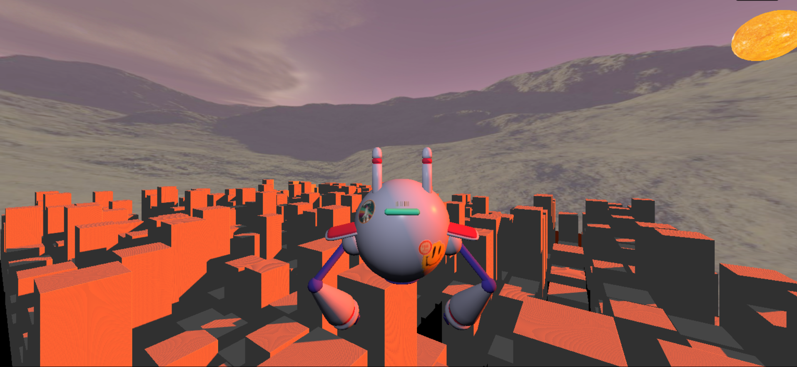
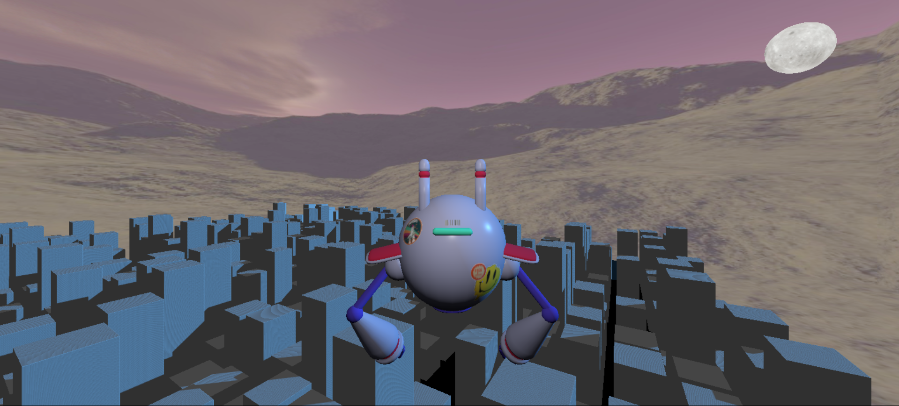
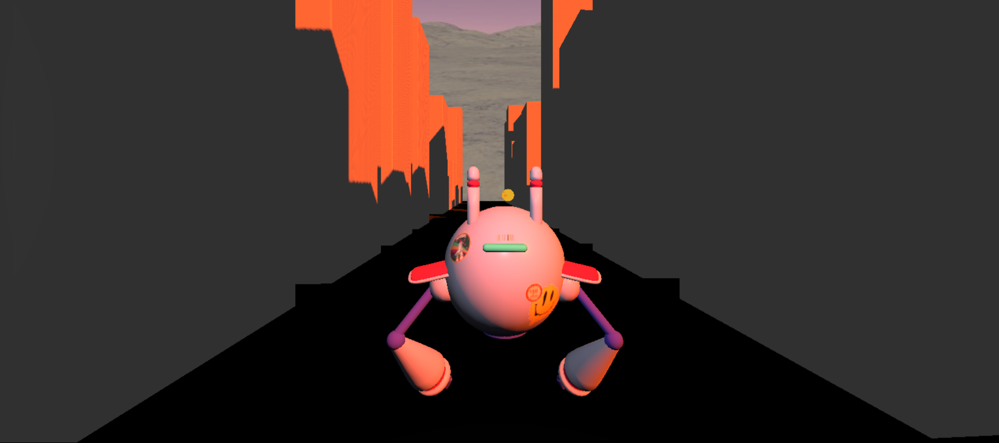
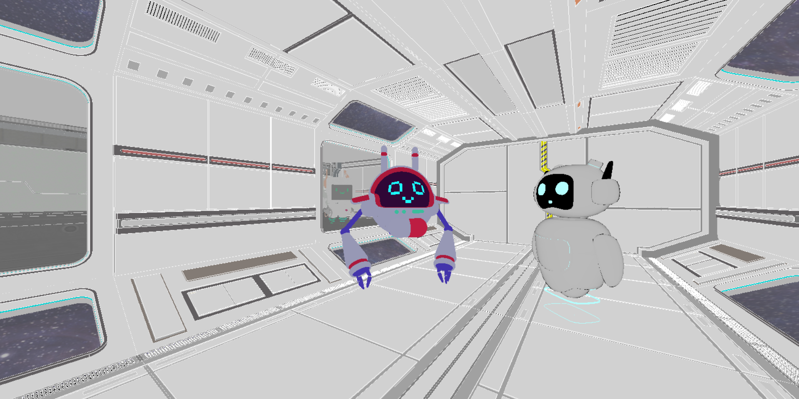

# Sun in The City

“Sun in The City” é um jogo em constante desenvolvimento, no qual o protagonista chamado You adquiriu uma identidade vívida e cativante, transformando-se em um simpático robô viajante, vivenciando jornadas interplanetárias em busca das valiosas esferas. You foi dotado de habilidades extraordinárias, entre elas a capacidade de voar e teletransportar, permitindo-lhe explorar o máximo de todas as aventuras existentes em cada planeta.

Este projeto foi desenvolvido como parte do processo avaliativo na disciplina de Computação Gráfica, componente curricular do curso Interdisciplinar em Tecnologia da Informação na UFERSA - Campus Pau dos Ferros.

# Imagens do Projeto
 
 
